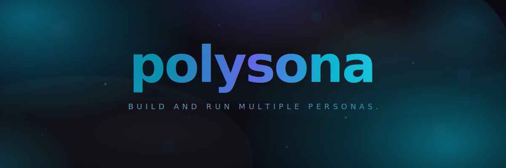

<p align="center">
  
</p>

<h3 align="center">Build and run multiple personas across any AI agent.</h3>

<p align="center">
  
  
  
</p>

## STOP THINKING LIKE A TEMPLATE

Every AI agent tool has the same problem: **it gives you someone else's answer, or it doesn't know you.**

gstack gives you Garry Tan's brain. **polysona gives you yours.**

## Why Polysona

- **The 10-framework interview**: We use 10 psychology frameworks across Western depth, Western supplement, and Eastern reflection to extract conscious goals, unconscious patterns, and the gaps between them.
- **Multi-Persona Engine**: You aren't just one person. Polysona builds and manages multiple personas (the executive, the creator, the gamer) across different domains.
- **Portability**: Your extracted persona isn't locked into one tool. It runs across any AI agent (Codex, Claude Code, OpenCode).

## Architecture

```text
┌─────────────────────────────────────────────────────────────┐
│                                                             │
│                    POLYSONA (Orchestrator)                  │
│     Build and run multiple personas across any AI agent.    │
│          Manage all persona data and agents                 │
│                                                             │
│  ┌─────────────────────────────────────────────────────┐    │
│  │                 SETUP (One-time)                     │    │
│  │                                                     │    │
│  │  ① Profiler                                          │    │
│  │     Interview → Extract logs                         │    │
│  │         │                                           │    │
│  │         ▼                                           │    │
│  │  [Polysona structures logs]                          │    │
│  │     → persona.md + nuance.md + accounts.md           │    │
│  │                                                     │    │
│  └─────────────────────────────────────────────────────┘    │
│                        │ persona data                       │
│                        ▼                                    │
│  ┌─────────────────────────────────────────────────────┐    │
│  │              LOOP (Per Content)                      │    │
│  │                                                     │    │
│  │  ② Trendsetter                                       │    │
│  │     Trend topics collection                          │    │
│  │         │                                           │    │
│  │         ▼                                           │    │
│  │  ③ Content-Writer                                    │    │
│  │     persona + trend → Platform-specific drafts       │    │
│  │         │                                           │    │
│  │         ▼                                           │    │
│  │  ④ Virtual-Follower (QA)                             │    │
│  │     Evaluate by rolemodel → TOP 5 → User picks       │    │
│  │         │                                           │    │
│  │         ▼                                           │    │
│  │  ⑤ Admin                                             │    │
│  │     Publish → Track engagement → Feedback            │    │
│  │                                                     │    │
│  └─────────────────────────────────────────────────────┘    │
│                                                             │
└─────────────────────────────────────────────────────────────┘
```

## Quick Start

```bash
# Codex (primary)
# AGENTS.md is auto-recognized by Codex
# Use $interview, $introduce, $trend, $content x, $qa, $publish, $status, $export in your Codex session

# Claude Code
# 1. Add local marketplace
claude plugin marketplace add ./.claude-plugin/marketplace.json
# 2. Install plugin
claude plugin install polysona
# 3. Start session (Hooks will auto-run)
# Then: /interview → /trend → /content x → /qa → /publish
```

## 5 Agents

| Name | Role | Command |
|---|---|---|
| **profiler** | Deep psychology interviewer | `$interview` / `/interview` |
| **trendsetter** | Trend detector | `$trend` / `/trend` |
| **content-writer** | Platform content generator | `$content` / `/content` |
| **virtual-follower** | QA simulator | `$qa` / `/qa` |
| **admin** | Publisher and tracker | `$publish` / `/publish` |

## Utility Commands

| Command | Purpose |
|---|---|
| `$introduce` / `/introduce` | Inject the current persona into the active session |
| `$status` / `/status` | Show grounded persona and pipeline status |
| `$export` / `/export` | Export persona-derived instructions into generated files for another workspace |

## Dashboard

Run the local-first dashboard to visualize your personas and content pipeline:

```bash
bun run dev
# Open http://localhost:3000
```

Features:
- Persona list from `personas/` directory
- System status and version
- Quick start commands reference

<!-- demo screenshots will be added -->

## Roadmap

**— v1: Korean Core + Product Quality —**
- **v1.0** Text content generation
- **v1.1** Persona extraction to CLAUDE.md/AGENTS.md + Multi-CLI marketplace support
- **v1.2** Local-first fullstack dashboard foundation
- **v1.3** Dashboard expansion + pipeline visibility + product polish
- **v1.4** Trend knowledge loop + stronger quality verification
- **v1.5** Full-version dashboard + demo polish
- **v1.6** External SaaS integration via MCP

**— v2: Korean Media Expansion —**
- **v2.0** Korean card news generation
- **v2.1** Korean short-form video scripts
- **v2.2** Korean long-form video scripts

**— v3: English Expansion —**
- **v3.0** English text content
- **v3.1** English card news
- **v3.2** English short-form scripts
- **v3.3** English long-form scripts

## Contributing & License

Polysona is open-source. Contributions are welcome. See `LICENSE` for more information (MIT License).
